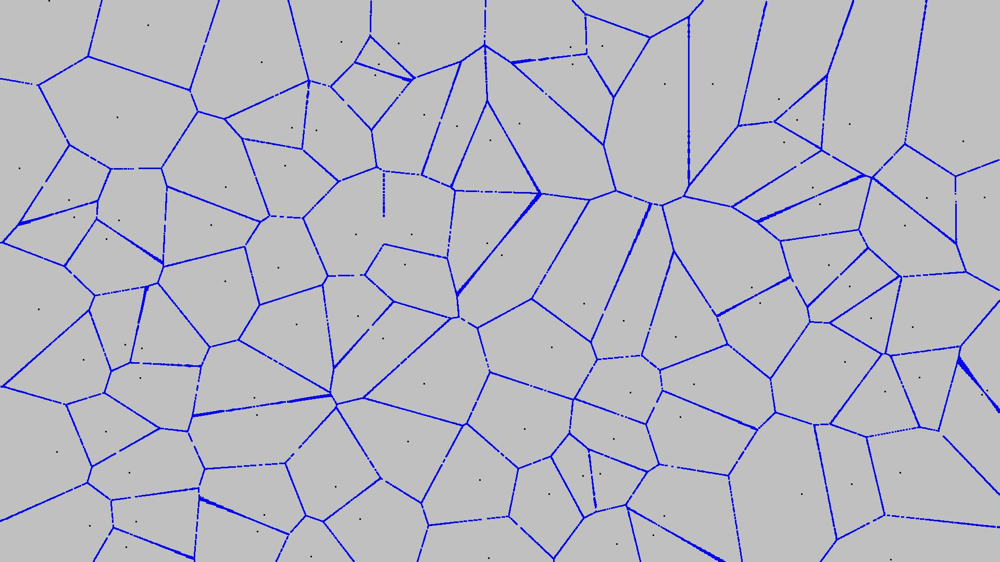

# Cells
 Generates a cell pattern image from random centroids by coloring pixels which are aequidistant to at least two centroids. 
 
## Table of contents
* [General info](#general-info)
* [Screenshots](#screenshots)
* [Status](#status)

## General info
 This is just a little project playing around with ImageIO and is supposed to visualize the Nearest-Neighbor-Condition for a 2-dimensional data set. 

## Screenshots

As one can see above, the continuity of the borderlines is still a problem to be fixed, most likely caused by bad rounding.
Possible new features include dynamic centroids, such as splitting and merging of cells.

## Status
Project is: _temporarily finished_, possibly with some issue fixing and new features down the line.
